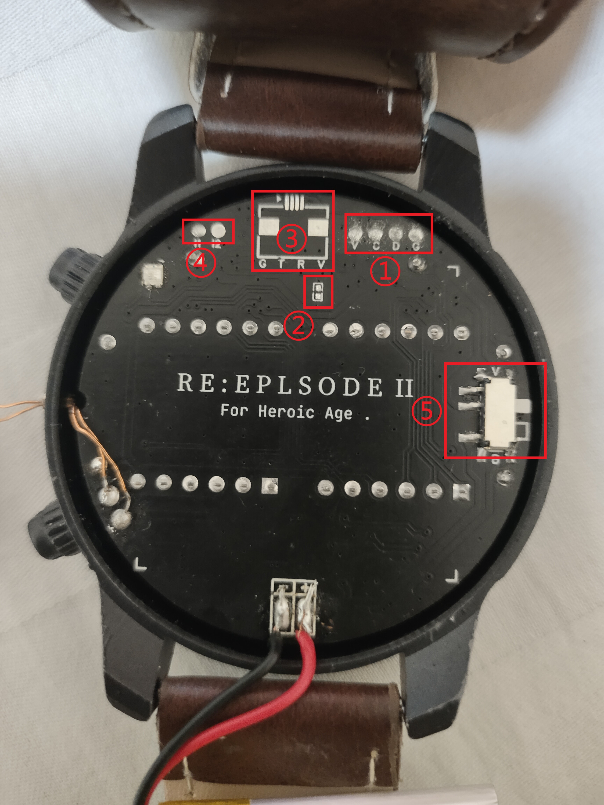

<h1 align="center">RE:Eplsode II</h1>

    
    ELP-05 FROM OXTRE..

## Overview

A amazing watch with hpdl1414.

 

 

## Features

1. DISPLAY : hpdl1414 x2
2. LED : Porcelain LED 17mm + SEFUSE 5x20mm
3. RGB : ws2812b
4. POWER : BQ51050
5. MCU : stm32l051
6. RTC : ds3231mz+
7. ACCE : lis2dw
8. key : Magnetic Reed Switch 1.8*7mm x2
9. BAT : 303030 280ma

 

## How To Program

After opening the back cover, you can see several hardware interfaces.

1. SWD(Program) : VCC(3v3),SWCLK,SWDIO,GND,with ***2.0mm*** pad spacing.
2. NRST and GND : NRST as up,with ***0402*** package size.
3. UART1 : GND,TX,RX,VCC(3V3),with ***0.5mm*** pad spacing.
4. IntPin Form ACCE : int1,int2,with ***2.0mm*** pad spacing.
5. LED_VOT_SWITCH : switch led drive level,include hpdl1414 and rgb(ws3231),vcc_vot as up(3v3), bat_vot as down(3.7 ~ 4.2).

 

If you don't know how to program the watch, you need to get a st-link first, then connect the swd interface to the corresponding pins on the st-link (you can use a connector with spring-loaded test pins). Then use the usual method to program it.  

  
   

Some libraries may not be found on the Arduino library manager, you can get these libraries through the following methods:  

[Evlk-NoPins-Library](https://github.com/EVOLINK-TEAM/Evlk-NoPins-Library)  
[Evlk-74HC595-Library](https://github.com/EVOLINK-TEAM/Evlk-74HC595-Library)  
[Evlk-HPDL1414-Library](https://github.com/EVOLINK-TEAM/Evlk-HPDL1414-Library)  

## Power Mode

The watch is divided into three power modes, Low Power Mode(<30%),Mid Power Mode(<70%),High Power Mode(<100%). The differences between the different power modes are as follows:  
| Mode | CPU | hpdl1414 | led | rgb |  
|:----:|:---:|:--------:|:---:|:---:|  
| Low  | slow|   Time   |BlinkOnce|No|
| Mid  | fast| Time+Date|Blink| Red |
| High | fast| Time+Date|Blink| Blue|

## Whats New

Here is the actual circuit board of version 1.0:

  
  

  

|Version | hpdl1414 |  mcu  | led | rgb | rtc | acce | btn | blu | wifi | charging |  
|:------:|:--------:|:-----:|:---:|:---:|:---:|:----:|:---:|:---:|:----:|:--------:|
|V1.0|2|esp8266|no|no|ds3231|no|out|yes|yes|out wireless|  
|V2.0|2|stm32l051|yes|yes|ds3231|lis2wd|in|no|no|in wireless

## And More?

[JLC](https://oshwhub.com/neko0.0/elp-05-eplsode-ii)  
[github](https://github.com/EVOLINK-TEAM/ELP05-Eplsode-II)
